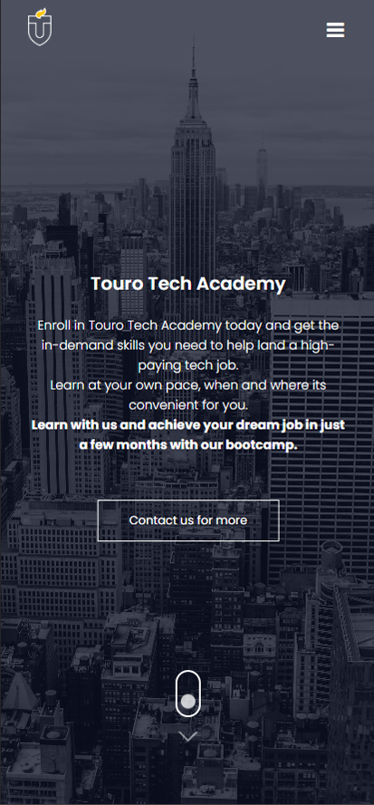
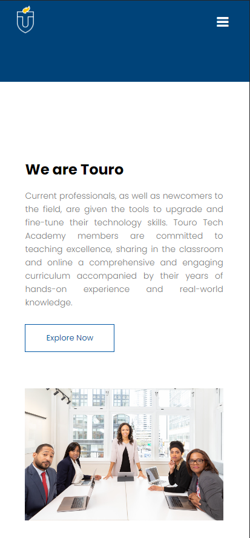
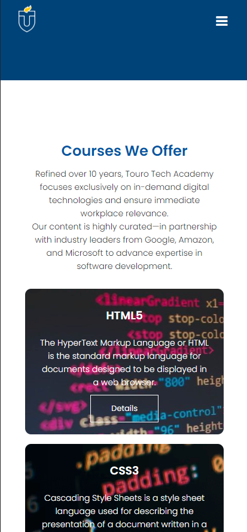
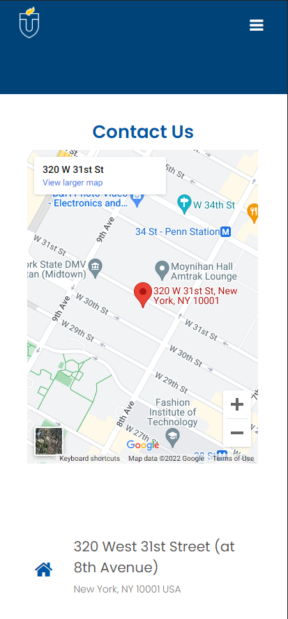

<!-- 

 -->

<!-- PROJECT LOGO -->
 

  <!-- 
   
  -->

  

    
    <h2 align="center">Graduate School of Technology  MSIN 617-Web and Application Development Course Final Project</h2>
     
  

  

    Simple responsive multipage website for virtual Touro Tech Academy
       
    <a href="https://amanmadov.github.io/msin617-final-project/index.html">View Demo</a>
  

<!-- ABOUT THE PROJECT -->
## About The Project

Since coding bootcamps are the most popular way of learning software development these days, this project simulates a virtual coding bootcamp website for Touro University. 

- [x] Tried to follow `responsive design guidelines` for the project and tested all pages with different devices. 
- [x] Color codes and the combinations are taken from `Touro University GST` website. 
- [x] Some of the text content is copied from `Touro University GST` and `Udacity` websites. 
- [x] Images used throughout the project are taken from `www.pexels.com`. 
- [x] Only `font-awesome icons` and Google's `Poppins` text font was used as an external resource.
- [x] No any `CSS framework` is used throughout the project.
- [x] Every CSS rule and HTML sections for different parts of the website is commented in detail. 
- [x] All the HTML and the CSS files are `validated`. 

<!-- TABLE OF CONTENTS -->

  
Pages

  <ol>
    <li><a href="https://amanmadov.github.io/msin617-final-project/index.html" target="_blank">Home</a></li>
    <li><a href="https://amanmadov.github.io/msin617-final-project/about.html" target="_blank">About</a></li>
    <li><a href="https://amanmadov.github.io/msin617-final-project/courses.html" target="_blank">Courses</a></li>
    <li><a href="https://amanmadov.github.io/msin617-final-project/blog.html" target="_blank">Blog</a></li>
    <li><a href="https://amanmadov.github.io/msin617-final-project/contact.html" target="_blank">Contact</a></li>
  </ol>

 

## Technologies Used
 - Visual Studio Code Version: 1.66.1
 - Google Chrome Version 100.0.4896.88

 

## Mobile View

  
  
  
  

 

<!-- CONTACT -->
## Contact

Nury Amanmadov - [@amanmadov](https://twitter.com/amanmadov) - amanmadov@gmail.com

Project Link: [https://github.com/amanmadov/msin617-final-project](https://github.com/amanmadov/msin617-final-project)

<!-- 
(<a href="#top">back to top</a>)
 -->

    

